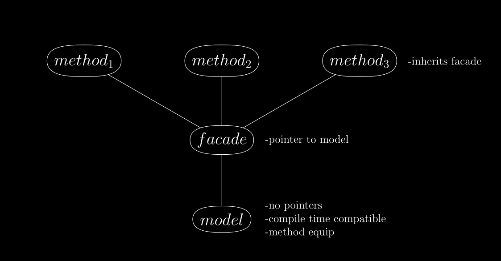
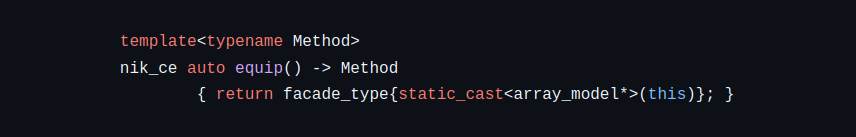
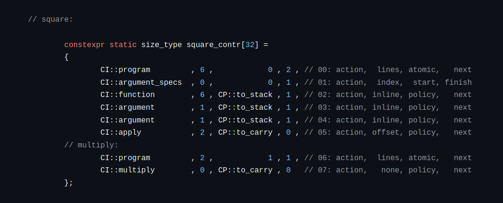
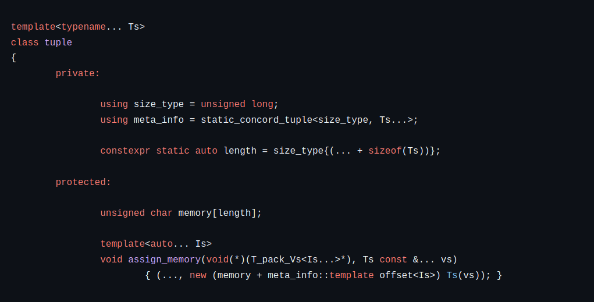
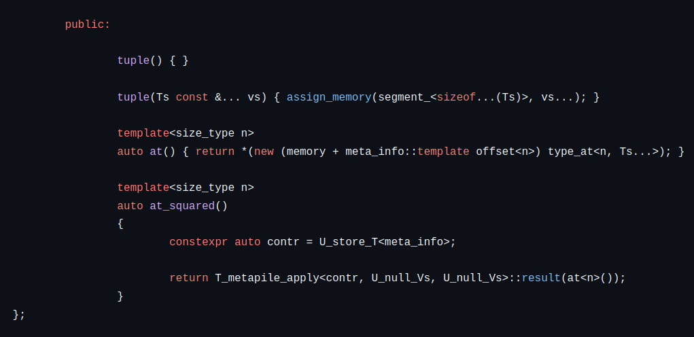
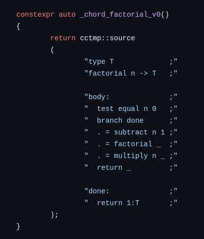
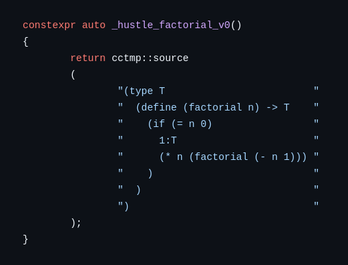

cpp-cctmp-library
-----------------

C++ continuation constructing template meta programming library:

A self-contained library that turns C++ into a proof assistant, with the intended
application of prototyping and building lexers, parsers, as well as compilers.

# Philosophy

Modern C++ needs to be **safe** C++. The code in this library is intended to meet the following designs:

1. Language tools such as lexers, parsers, and compilers need to be safe, expressive, potent.
2. Such tools demand the highest level of scrutiny when it comes logical consistency.
3. Achieving both consistency and performance in tooling is *preferred*.
4. When a tradeoff is required, consistency of tooling is *privileged* over performance.

# Methodology

Here I summarize the paradigms employed to achieve the above stated philosophical designs. Following this
we will go through each idea in greater detail.

In the most general sense, my approach to the problem of C++ safety is aligned with the *subset of a superset*
strategy, where the C++ language is first extended and that extension is then subsetted to be safe. My approach
differs in how it goes about trying to achieve this goal.

In particular, I claim C++17 and above are already powerful enough that safe extensions can be simulated
at compile time, to be used in the compilation process without additional cost to run time performance.
This is achieved through several techniques making use of C++'s multiparadigm features.

Before continuing, I should clarify this library does **not** use other libraries
such as Boost or even the C++ standard (std::).

## Method Equip

The first paradigm of this library is a specialized version of C++ object
oriented programming designed to be compatible with compile time use:

Models are classes intended to hold simple data structures (such as C style arrays) and as few member functions
as possible. They have no pointer members which means they can be assigned as general constexpr values. As these
models are intended for compile time use, the their memory sizes are expected to be known in advance. Models also
have a special collection of *equip* member functions:

This paradigm can be considered a variation of *dependency injection*, but the overall idea is to modularize
member functions out of data structure classes: Instead of hardcoding the member functions into a single model
class, we equip the models with method classes as needed.

For example we may wish to *push* a value to an array in one context, but in another we might want to push
without duplicate values. This can be done as two separate array classes, or even two separate member functions
within the same class, but the method equip paradigm allows us to achieve the same effect while keeping code
organization cleaner, and with the ability to reuse names (such as "push").

This also means we can call method classes inside the definitions of other method classes that share the same model,
which is a very powerful technique used critically throughout this library.

Finally, this paradigm is compile time compatible because it shifts the use of temporary pointers to method classes
whose lifetimes themselves are meant to be temporary.

This paradigm underlies and acts as foundation for all other code in this library.

## Type Theory

The major paradigm of this library is to introduce an algebra of proof assistants which are
based on formal type theory. I reference the following two textbooks as theoretical sources:

[Type Theory and Functional Programming](https://www.cs.kent.ac.uk/people/staff/sjt/TTFP/ttfp.pdf)

[Homotopy Type Theory](https://homotopytypetheory.org/book/)

Think of these proof assistants as secondary or *second-tier* type systems to be used alongside
C++'s builtin one. Such type systems are intended at minimum to support the following types:

- empty
- ring (~unsigned integers)
- flex (~floating point numbers)
- utf8\_char
- tuple
- cotuple (~std::variant)
- function
- list (~singly linked list)
- identity
- forall
- exists

The idea is, once you introduce the *identity* type as well as dependent types such as *forall* and *exists*,
you can then represent mathematical **specifications** as objects within the type system itself.

The bigger picture is that specifications can be defined within the type system, and then **proofs**
(which are also represented in the type system) can be given and verified to show that objects
of interest meet our requirements.

### Compile Time Use

Modern C++ offers the *constexpr* keyword. Because of this,
we can refine our understanding of what *compile time* means:

1. **metacompile time** - C++ objects / values are immutable and can generally be passed as template parameters.
2. **metarun time** - C++ objects / values are mutable within restricted scopes. They are not able to be passed
as template parameters, but become metacompile time versions of themselves when their lifetimes extend beyond
those restricted scopes.

The proof assistants in this library are designed to be compatible as compile time objects: They can be built
during metarun time scopes, and then used at metacompile time to help build C++ runtime code. There are several
benefits in adhering to this style of design.

#### Undefined Behaviour

One of the greatest benefits in using these proof assistants is that C++ compilers do not allow *undefined behaviour*
at compile time. This means we exclude entire classes of bugs from hiding in our code, and improving program safety.

How does this work?

When the compiler runs your code at compile time it is acting as an interpreter. Compilers more than any other software
require strict guarantees such as the assurance that they will **halt**. For example: Is your program compiling?
Or is the compiler stuck in an infinite loop? No one wants that as a possibility!

For this reason, C++ compilers do not allow any *undefined behaviour* while running compile time code. With that said,
there are tradeoffs, primarily when we're running large programs at compile time.

One of the greatest disadvantages is compiler resource requirements, for example
I set the following compiler options when running this library's code on my laptop:

-GCC -fconstexpr-depth=2048

-Clang -fconstexpr-steps=2097152 (2^21)

Another disadvantage related to this is performance: Interpreters tend to be orders of magnitude slower than running
compiled code. If done well, the slowdown is in the seconds range. If done poorly, it's in the minutes range or longer.
There are ways to mitigate this which will be discussed in the following section (in the serialization subsection).

#### Metacompilation

At this point you might be asking: What about functions within these type systems? How are they run at compile time?

Function values are represented internally using an in-house bytecode that resembles assembly language.
Below is an example of bytecode defining the *square* function:

This library supports running this style of bytecode at compile time in two distinct ways:

1. Virtual Machines (VM) - Method classes are provided that allow one to run bytecode using a virtual machine.
2. Continuant Machines (CM) - An emergent effect using templated and variadic continuation passing
   functions that effectively injects bytecode into the C++ compiler's syntax tree.

What are the differences between the virtual and continuant machine approaches?
The easiest explanation is summarized in this (informal) data table for the above *square* function:

|Compiler |VM Binary Size|CM Binary Size|
|---------|--------------|--------------|
|GCC   -O1|           36K|           16K|
|Clang -O1|           72K|           16K|

The virtual machine is software that simulates hardware, and runs this library's bytecode on top of it.
As for continuant machines, C++ compilers end up recognizing this library's bytecode as C++ functions
which run directly on hardware. This is to say: The VM approach creates larger binary
file sizes, and is slower than the CM approach in terms of performance.

I will add that although CM is an emergent effect, it is of sound design.
I have given two talks about it linked here:

[C++ is a metacompiler - C++Now 2024](https://www.youtube.com/watch?v=IgNSBXypwrY)

[C++ is a metacompiler - CppNorth 2024](https://www.youtube.com/watch?v=zngToaBjHVk)

## Proof Oriented Programming

It should first be noted it is the policy of these type systems that their *values* are immutable and unique.
These restrictions allow us to compress the representation of values using index indirection. They also free
us from the equivalent of pointer lifetime bugs that would otherwise occur through such internal indirections.

How do we gain access to mutability and duplication?
The answer to this is the *proof oriented programming* (POP) paradigm.

We can use our type systems to model allocation data structures which keep track of symbolic
address indices to runtime (or metarun time) memory that lives outside these proof assistants.

Proof oriented programming in this context is an extension of C++ object oriented programming (OOP).

Think of it like this: One of the major features of object oriented programming is the ability to define
member values and member functions. We can now simulate this by assigning a predefined compile time
type system to a C++ class defined with a flat memory container such as std::array or std::vector.

The assumption is the type system will contain the desired functions (and even constant values),
as well as the structural information needed to complete the OOP class definition:

In this code example, *meta_info* is our type system (defined elsewhere).
We use it and *placement new* to read from and write to the class memory.

As our type system consists of *algebraic data types*, it is sufficiently expressive to represent any possible
data structure in C++.

### An Alternative to C++ Concepts

By simulating object oriented programming in this way, we are also extending its abilities. During the construction
of a given type system (at metarun time), we can create specifications and proofs demonstrating the class we're about
to define has certain properties of interest. This is similar to *C++ concepts* except it is much more powerful as
we can prove any *mathematical truth* about these types, values, and functions.

### Error Messages

POP also allows us to create an improved interface for compile time error messages. A string type can be defined as
a list of characters, where a character is a cotuple of the four builtin utf\_char types distinguished by byte size:

Utf8String := List Utf8Char

Utf8Char   := (Utf8Char1 | Utf8Char2 | Utf8Char3 | Utf8Char4)

From there, when we write code that recognizes an error, it can be logged as a string and then the program can
short-circuit. Once our type system finishes being built, we then check if it has any errors, and dispatch
the logged messages accordingly.

## Self Hosting

The self hosting paradigm of this library is intended to complement proof oriented programming.

Self hosting is the pattern of using a programming language to write the next version of its own compiler.

This paradigm is fundamental to this library as it provides the following benefits:

- It is well suited for prototyping variations on compiler design (before the next version is complete).
- In the context of compile time programming it mitigates the use of compiler resources through *serialization*.
- It mitigates compilation units, and thus compile times themselves.

It should be noted that I choose to use the term *semiself hosting* to distinguish the fact that this library
is not necessarily meant to build a full C++ compiler: It is meant to build lexer and parser generators,
as well as specific lexers and parsers for embedded languages.

In fact the main technique for achieving semiself hosting within this
library is the use of embedded domain specific languages (DSLs).

### Domain Specific Languages

The idea is we first build a version 0.0.0 *parser generator* using regular compile time C++.
We do the same for a lexer generator. With these we then build a small number of domain specific languages
which are represented as string literals.

The goal is to use these initial DSLs to make it easier to generate type system byte code for functions.
Once this is achieved, we use these DSLs to generate byte code for version 1.0.0 lexer and parser generators.
Once we have such generators defined as types and values internal to our proof assistants, we can specify and
prove their consistency and reliability.

We then use these generators and DSLs to build richer next version DSLs that allow us to rebuild our base
tools yet again. This is the meaning of semiself hosting within this library.

It all sounds nice, but is this achievable?

I have already built an LL parser generator along with two domain specific languages respectively named
*Chord* and *Hustle* in the **proof of concept** version of this library. The Chord language offers grammar
to readily create functional style operators { repeat, map, fold, find, sift }, but otherwise gives
a grammatical appearance similar to assembly language pseudocode. As for Hustle, it is intended to be
a Scheme-like (LISP) language.

Here are example programs in each language:

It should be noted that these type systems have a second purpose in this library: Direct support in creating
new DSLs.

### Serialization

As our type systems grow in complexity, either by growing our inventory of functions, or of proofs, how do we
mitigate slow metacompile times? The short answer: *Serialization*.

One of the reasons I chose the *method equip* paradigm for designing the compile time data structures of this
library is because it aligns well with serialization. The type systems of this library are in actuality each
a handful of numerical arrays. It means they are easy to print out to file. It also means they are easy to read
back in to rebuild a given type system when restarting the compilation process.

In practice we will build, analyze, and verify at metarun time: All of which will be applied to functions,
specifications, and proofs. Rather than repeating this work every time we recompile, we can write the results
to file to be read back in as compile time objects. In effect we are saving our work. This is similar to the way
C++ compilers build *object code* which can be *linked* during final compilation.

There are several benefits to doing serialization in this way. Two of which I note here:

First, rather than type checking a bytecode function every single time we run (and rerun) the compiler,
we can write a type checking specification and prove the given function to be valid. If we keep the proof we
don't need to reverify every single time---unless prompted to do so.

Second is being able to allocate accurate model sizes. When building a new type system at compile time
the first time around, we would allocate extra memory not knowing how much we need in advance. When the type
system of interest has stabilized, it can be written to file using only as much memory as is required. When
reading the type system arrays back in, we now know in advance the exact memory size we need and so can
optimize memory use with that in mind.

## Interoperability

How do these second-tier type systems interoperate with C++'s type system?

### C++17, C++20, C++23

Interoperability has some limits in these language versions. Notably floating point numbers.

The type systems in this library are currently designed in C++17, and only support internal arrays
of a generic but fixed integer type. As consequence, representing floating point numbers as type system
values must be simulated which comes with tradeoffs.

The other consideration is whether or not we can represent C++'s non-builtin types using these second-tier
systems. Any solution to this consideration requires byte alignment analysis, which isn't readily supported.

As result of the above, type system values require ad-hoc designs to achieve interoperability. One noteworthy
solution comes into play when we are using the proof oriented paradigm: Proper runtime values can be translated
between type system tiers using **placement new** so long as the runtime memory is preallocated.

### C++26

C++26 is well suited for toward the methodology of this library.
It has a number of features which are of immediate use:

- variadic indexing
- static\_assert
- placement new
- #embed
- reflection

These features immediately solve the interoperability problems of C++17 through C++23.

Variadic indexing can be used to simplify continuant machines. Static assert means the error messages of our compile
time type systems can be directly printed out as part of the compiler's error message. Placement new can be
used at compile time, meaning floating point numbers can be represented directly, and byte alignment can be used
to map C++'s non-builtin types directly into and out of these second-tier type systems.

# Motivation

This section is about my personal motivation for working on this project.

## Long Term Goals

I am building this library with two long term goals in mind:

1. **Individual goal**: I took 6 honours math classes in my undergrad, it taught me the value of *mathematical rigour*.
                        I want one life project for myself that is intellectual in nature, challenges my very being,
			and honours the high standards of my education.
2. **Community goal**:  I intend to start an Indigenous multimedia studio for Indigenous youth (in Canada) to tell
                        their own stories. The plan is to build an in-house multimedia programming language
		        (along with its compiler) for their use. The hope is for them to use this studio
		        as a platform to develop new skills and further their educational aspirations.

## Medium Term Goals

My community-based long term goal is still years from fruition.

My medium term goal is to start a business based on the completion of this library. The plan is to create
an **online hub** where academics can access user-friendly domain specific languages to help them solve
the computational problems that occassionally come up within their specific domains.

Is there a market for this?

My answer is anecdotal: I have met many grad students from various disciplines over the years who have shown me
the programs and code they have to use in their research. They had horrendous interface designs. If you're not
a practiced computer programmer you shouldn't be wrestling with bad grammar, you should be working with
languages that represent your thought processes so that you can focus on the problems you're trying to solve.

What is my business model?

Individual academic departments might not be willing to foot the bill for such an online hub, but if I can show
there's enough interest, then such departments can pool their resources. Also, Universities and colleges get
their funding from government, and so there might be funding opportunities there as well.

My business will likely be a *non-profit*, my intent is humble: I'm only looking to do a bit of good for
academic programmers, and give myself a sustainable income so I can keep working toward my long term goals.

# Fundraising

Given the above motivation, I am fundraising so that I can keep working on this project full-time:

https://ko-fi.com/danielnikpayuk

- If you like the ideas I've presented, or you want to support my above goals, please donate.
  Every bit helps. Thank you.
- If you are part of a business that wants to sponsor this project, please reach out to me for finer details.

# Roadmap

The initial version of this library is archived as the proof of concept version.

The current version is what I would call a negotiating version. I have outlined the major paradigms
I am using in this project. These designs have stabilized, but before I commit to making the
production ready version, I still need to negotiate a few designs.

Notably, the bytecode is not fully stable. Before it can reach that level, I have to build more of the library
itself in order to know *how best* to resolve the small but important design decisions that remain.

As for building the library, the targets and their timelines are as follows, but it should be noted that what's
given here assumes that this project is being worked on full-time:

## Proof Assistant Types:

- [x] empty
- [x] ring
- [ ] flex (deferred)
- [ ] utf8\_char (a day or two)
- [x] tuple
- [x] cotuple
- [x] function
- [x] list
- [ ] identity (deferred)
- [ ] forall (deferred)
- [ ] exists (deferred)

It should be noted that the designs for the proof types are already specified, I just haven't implemented them yet.
My plan is to wait until I have enough DSL tools to build domain specific languages for writing proofs.

## Semiself Hosting:

- [ ] LL parser generator (one month)
- [ ] LR parser generator (two weeks)
- [ ] Lexer generator (two weeks)
- [ ] Chord DSL (two weeks)
- [ ] Hustle DSL (two weeks)
- [ ] error messaging (deferred)
- [ ] unit tests (ongoing)

It should be noted that I've already implemented an LL parser generator in the proof of concept version of
this library. The hard work is done, it only needs to be translated into the paradigm styles of this library.

As for the LR parser generator: I'm estimating two weeks because although I know the theory of LR parsers,
I've never implemented one before. With that said, as LR generators share the "first" and "follow" algorithms
of LL generators, I can reuse the code there which will speed things up.

The Chord and Hustle DSLs shouldn't take as long because they've largely been researched in the proof of concept
version of this library. I will also have the lexer and parser generators available for use by then,
so it's largely a matter of translating existing code into this version.

Thank you.

